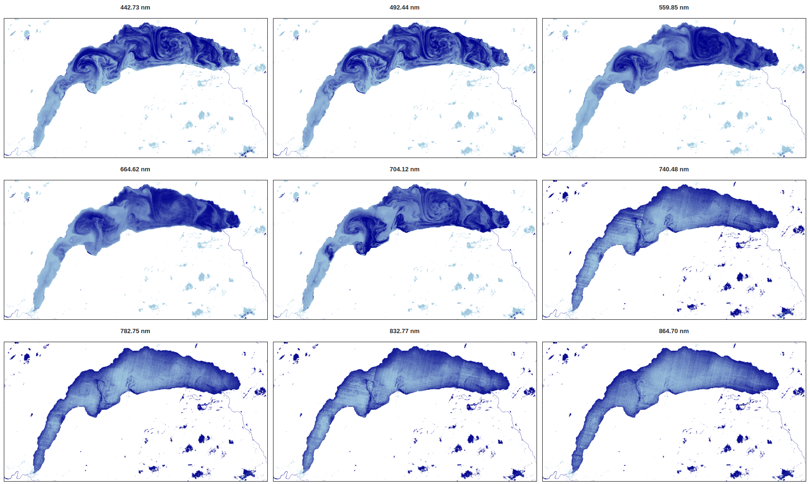

# **grstbx**
## **Scientific code and notebooks to visualize and post-process GRS L2A and L2B images** 


## Example


## Documentation

Tutorials and API reference: https://grstbx.readthedocs.io

## Installation

grstbx requires Python >= 3.11. Clone [the repository](https://github.com/Tristanovsk/grstbx) and
create the conda environment (recommended: GDAL, PROJ and xesmf come from conda-forge), which also
installs grstbx in editable mode:

```
git clone https://github.com/Tristanovsk/grstbx.git
cd grstbx
conda env create -f environment.yml
conda activate grstbx
```

or install it with pip in an existing environment:

```
pip install ".[notebook]"      # library + JupyterLab environment
pip install .                  # library only
pip install -e ".[notebook]"   # editable install, for development
```

| extra | content |
|---|---|
| `notebook` | JupyterLab, ipykernel, jupyter_bokeh |
| `regrid` | xesmf (`grstbx.utils.Reproj.regridding`), preferably `conda install -c conda-forge xesmf` |
| `docs` | Sphinx and extensions to build the documentation |
| `all` | `notebook` and `docs` |

The export of subsets (`grstbx.export_l2a`, `grstbx.crop_and_export`) uses the writers of
[GRS](https://github.com/Tristanovsk/grs): it needs `grs >= 3.0.1` in the same environment.

To register the environment as a Jupyter kernel:

```
python -m ipykernel install --user --name=grstbx
```

## Example of L2A image


