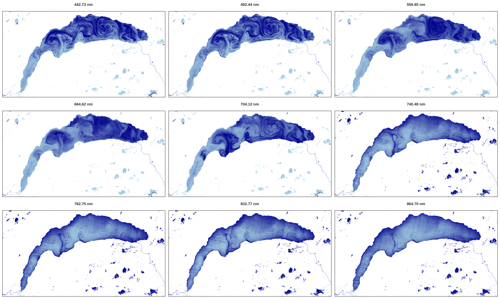

# **grstbx**
## **Scientific code to visualize and post-process GRS L2 images** 
## --> remote sensing reflectance (Rrs) 


## Getting Started

These instructions will get you a copy of the project up and running on your local machine for development and testing purposes.

### Prerequisites

What things you need to install the software and how to install them

```
conda install -c pyviz geoviews
```

### Installing

First, clone [the repository](https://github.com/Tristanovsk/invRrs#) and execute the following command in the
local copy:

```
python3 setup.py install 
```

This will install the package into the system's Python path.
If you have not the administrator rights, you can install the package as follows:

```
python3 setup.py install --user
```

If another destination directory is preferred, it can be set by

```
python3 setup.py install --prefix=<where-to-install>
```

## Some example of the forward model:


